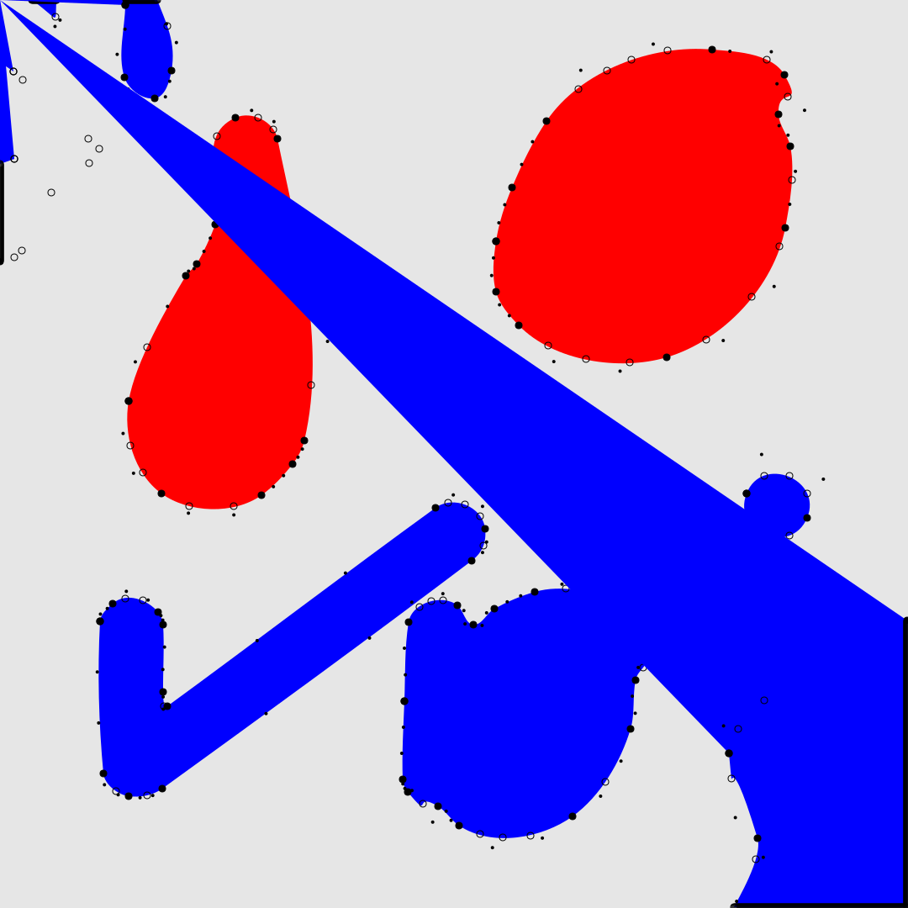

# `imagetrace`

A simple TypeScript library for converting raster images to vector graphics, given the set of colours to trace for. This library is meant for flat, organic, 2D shapes with a uniform colour. I built this package to be used with the output of a shader script.


npm: https://www.npmjs.com/package/imagetrace

## Features

-   🔄 Raster to vector conversion
-   🎯 Color-based region detection
-   🎨 Blob detection algorithm
-   🤹 Blob separation algorithm
-   ✒️ Point visualization option
-   💪 TypeScript type safety

## Example

|          Input PNG           |              Output SVG              |
| :--------------------------: | :----------------------------------: |
|  |  |
|    |    |

The example above shows the conversion from a raster PNG image (left) to a vectorized SVG output (right). Notice how the library:

-   Detects color regions
-   Preserves shapes
-   Creates simple vector paths
-   Skips holes ⚠️
-   Gives an option for viewing the path points: the simplified polygon (stroked black) and bezier points (filled black)

## Installation

```bash
npm install imagetrace
```

## Quick Start

```typescript
import { ImageTrace } from 'imagetrace';

// get image data from a canvas or blob
const imageData = canvasContext.getImageData();

// define the color palette for the shapes you want to trace
const palette = [
	{ r: 255, g: 0, b: 0 }, // red
	{ r: 0, g: 0, b: 255 }, // blue
];

// configure the tracer
const options = {
	chaikinSmoothingSteps: 5,
	smoothingMinLength: 5,
	pixelGridStepSize: 1,
	debugPointRadius: undefined,
};

// create a new tracer instance
const tracer = new ImageTrace(imageData, palette, options);

// get SVG output
const svg = tracer.getSVGString();
```

## API Reference

### ImageTrace

Main class for converting raster images to vector graphics.

```typescript
new ImageTrace(
    imageData: ImageDataLike,
    palette: Color[],
    options: ImageTraceOptions
)
```

#### Options

| Option                | Type   | Default   | Description                          |
| --------------------- | ------ | --------- | ------------------------------------ |
| smoothingMinLength    | number | -         | Minimum length for path smoothing    |
| chaikinSmoothingSteps | number | -         | Number of smoothing iterations       |
| pixelGridStepSize     | number | 1         | Pixel point cloud sampling interval  |
| debugPointRadius      | number | undefined | Radius for debug point visualization |

## Development

### Prerequisites

-   Node.js
-   npm

### Setup

```bash
# install via npm
npm install imagetrace
```

### Building a clone

```bash
npm run build
```

### Testing

```bash
npm test
```

### Basic Usage

```typescript
import { ImageTrace } from 'imagetrace';

// load your image data
const canvas = document.createElement('canvas');
const ctx = canvas.getContext('2d');
const imageData = ctx.getImageData(0, 0, width, height);

// create tracer instance for yellow shapes
const tracer = new ImageTrace(imageData, [{ r: 255, g: 255, b: 0 }], {
	pathSimplificationTolerance: 3,
	curveFittingTolerance: 2,
	minHullDistance: 3,
});

// get SVG output
const svg = tracer.getSVGString();
```

## Credits

### Dependencies

-   [concaveman](https://github.com/mapbox/concaveman) - A fast 2D concave hull algorithm by Vladimir Agafonkin (@mourner)

### Inspirations

-   Jeff Thompson's blob detection experiments:

    -   [Webcam Tracking Demo](https://www.youtube.com/watch?v=G7u26vfiUX8)
    -   [p5.js sketches](https://editor.p5js.org/jeffThompson/sketches/rFeSWevtU)

-   [ImageTracerJS](https://github.com/jankovicsandras/imagetracerjs) by András Jankovics, a raster image tracer and vectorizer written in JavaScript

## Contributing

Contributions are welcome!

1. Fork the Project
2. Create your Feature Branch (`git checkout -b feature/AmazingFeature`)
3. Commit your Changes (`git commit -m 'Add some AmazingFeature'`)
4. Push to the Branch (`git push origin feature/AmazingFeature`)
5. Open a Pull Request

## License

This project is licensed under the MIT License - see the [LICENSE](LICENSE) file for details.

## Performance Notes

-   Processing time varies with image size and complexity
-   For optimal performance, consider:
    -   Adjusting `pixelGridStepSize` for larger images
    -   Tuning `smoothingMinLength` based on image size
    -   Running locally rather than in web-based environments

## Support

-   Create an [issue](https://github.com/aidanwyber/imagetrace/issues) in the GitHub repository

## Roadmap

-   [x] Automatic SVG download
-   [ ] More detailed smoothing options
